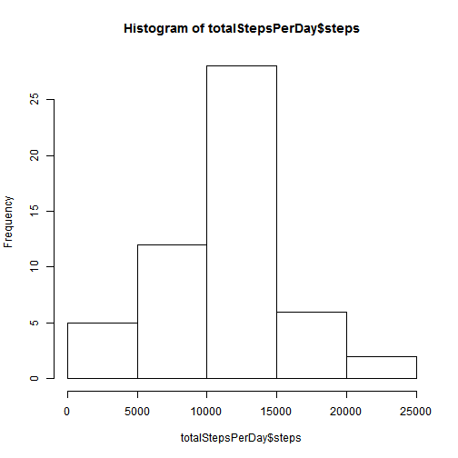
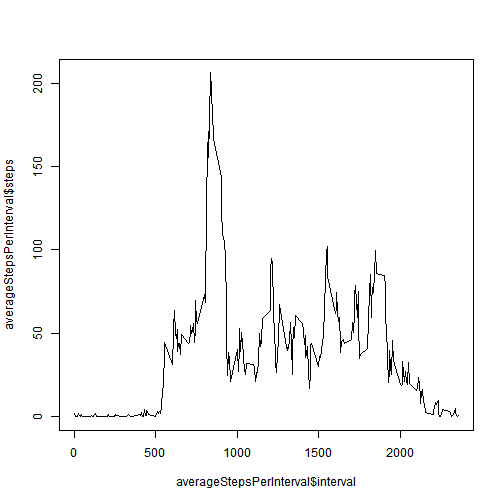
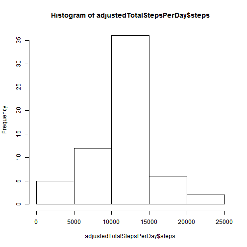
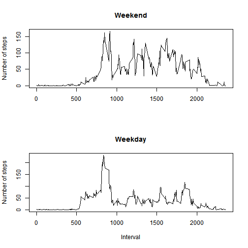

# Reproducible Research: Peer Assessment 1


## Loading and preprocessing the data

```r
inputFile <- "activity.zip"
activityFile <- "activity.csv"
activityData <- read.csv(unz(inputFile, activityFile))
```

## What is mean total number of steps taken per day?

Calculate the total number of steps per day and plot the histogram for that data

```r
totalStepsPerDay <- aggregate(steps~date, data=activityData, sum)
hist(totalStepsPerDay$steps)
```

 

Calculate the mean total number of steps taken per day

```r
mean(totalStepsPerDay$steps)
```

```
## [1] 10766
```

Calculate the median total number of steps taken per day

```r
median(totalStepsPerDay$steps)
```

```
## [1] 10765
```

## What is the average daily activity pattern?
Calculate and plot the average number of steps taken per 5-minute interval

```r
averageStepsPerInterval <- aggregate(steps~interval, data=activityData, mean)
plot(averageStepsPerInterval$interval, averageStepsPerInterval$steps, type="l")
```

 

Determine the 5-minute interval, which contains the maximum number of steps, 
on average across all the days in the dataset

```r
averageStepsPerInterval$interval[which.max(averageStepsPerInterval$steps)]
```

```
## [1] 835
```

## Imputing missing values
Calculate the total number of missing values in the dataset

```r
sum(!complete.cases(activityData))
```

```
## [1] 2304
```

The strategy for filling in all of the missing values in the dataset 
is to use the rounded mean for the corresponding 5-minute interval

```r
adjustedActivityData <- activityData
for(i in 1:nrow(adjustedActivityData)){
    if(is.na(adjustedActivityData$steps[[i]])) {
        interval <- adjustedActivityData$interval[[i]]
        intervalIndex <- which(averageStepsPerInterval$interval == interval)
        adjustedActivityData$steps[[i]] <- 
            round(averageStepsPerInterval$steps[[intervalIndex]])
    }
}
```

Calculate the total number of steps per day and plot the histogram for that data

```r
adjustedTotalStepsPerDay <- aggregate(steps~date, data=adjustedActivityData, sum)
hist(adjustedTotalStepsPerDay$steps)
```

 

Calculate the mean total number of steps taken per day

```r
mean(adjustedTotalStepsPerDay$steps)
```

```
## [1] 10766
```

Calculate the median total number of steps taken per day

```r
median(adjustedTotalStepsPerDay$steps)
```

```
## [1] 10762
```

The mean total number of steps taken per day for the new dataset 
is the same as for the original dataset.

The median total number of steps taken per day for the new dataset 
is slightly less than the number for the original dataset.

## Are there differences in activity patterns between weekdays and weekends?

Create a new factor variable in the dataset indicating whether a given date 
is a weekday or weekend day

```r
adjustedActivityData$daytype <- lapply(adjustedActivityData$date, 
    function(day) if(weekdays(as.POSIXlt(day)) %in% c("Saturday", "Sunday")) 
                        "weekend" else "weekday")
```

Make a panel plot containing a time series plot of the 5-minute interval 
and the average number of steps taken, averaged across all weekday days
or weekend days

```r
averageStepsPerIntervalWeekend <- aggregate(steps~interval, 
    data=adjustedActivityData[adjustedActivityData$daytype == "weekend", ], 
    mean)

averageStepsPerIntervalWeekday <- aggregate(steps~interval, 
    data=adjustedActivityData[adjustedActivityData$daytype == "weekday", ], 
    mean)

par(mfrow=c(2, 1))

plot(averageStepsPerIntervalWeekend$interval, 
     averageStepsPerIntervalWeekend$steps, type="l", 
     main="Weekend", xlab="", ylab="Number of steps")

plot(averageStepsPerIntervalWeekday$interval, 
     averageStepsPerIntervalWeekday$steps, type="l", 
     main="Weekday", xlab="Interval", ylab="Number of steps")
```

 
